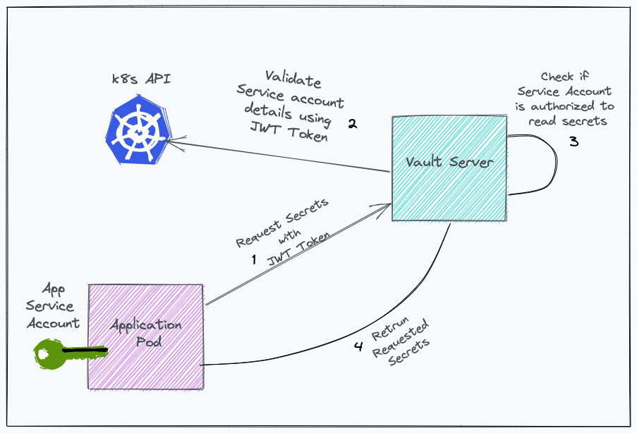

# PRESENTATION

## Definition

### Cluster Kubernetes

Un cluster Kubernetes est un ensemble de machines (les nœuds) qui permettent d'exécuter des applications conteneurisées. Si vous exécutez Kubernetes, vous exécutez un cluster.

source : https://www.redhat.com/fr/topics/containers/what-is-a-kubernetes-cluster

### Service account

Un ServiceAccount (compte de service) fournit une identité pour les processus qui s'exécutent dans un Pod.

### Kubectl

L'outil en ligne de commande de kubernetes, kubectl, vous permet d'exécuter des commandes dans les clusters Kubernetes.

### Minikube

Minikube exécute un cluster Kubernetes à nœud unique dans une machine virtuelle (VM) en local.

## How ?

source : https://devopscube.com/vault-in-kubernetes/

## Authentication by k8s

    vault auth enable kubernetes

    vault write auth/kubernetes/config issuer="https://kubernetes.default.svc.cluster.local" token_reviewer_jwt="$(cat /var/run/secrets/kubernetes.io/serviceaccount/token)" kubernetes_host="https://$KUBERNETES_PORT_443_TCP_ADDR:443" kubernetes_ca_cert=@/var/run/secrets/kubernetes.io/serviceaccount/ca.crt

## Create policy for node application

    vault policy write node-express-api-node-helm - <<EOH
    path "internal/data/database/config" {
    capabilities = ["read"]
    }
    EOH

## The role connects the Kubernetes service account with the Vault policy.

The tokens returned after authentication are valid for 24 hours.

    vault write auth/kubernetes/role/node-express-api-node-helm bound_service_account_names=node-express-api-node-helm bound_service_account_namespaces=default policies=node-express-api-node-helm ttl=24h

